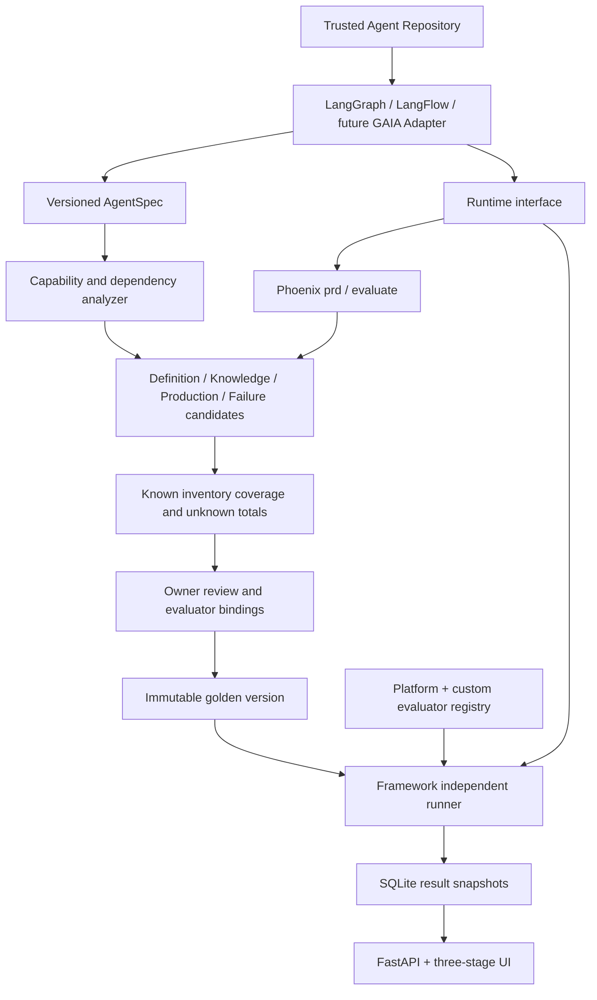

# Architecture

Adapters own framework parsing and execution. Core never imports LangGraph or LFX and contains no sample identifiers. A manifest provides otherwise unknowable business probes with explicit provenance; discovered nodes and edges come from actual framework definitions. Unknown capability totals remain unknown. Mock knowledge/search and tools implement replaceable interfaces. Each run executes the selected golden snapshot, recording AgentSpec fingerprint, model and evaluator definitions; golden evaluator bindings are frozen at approval. Async API endpoints offload blocking work to threads. This local PoC uses one SQLite transaction per mutation and immutable snapshots, not a distributed worker service.
